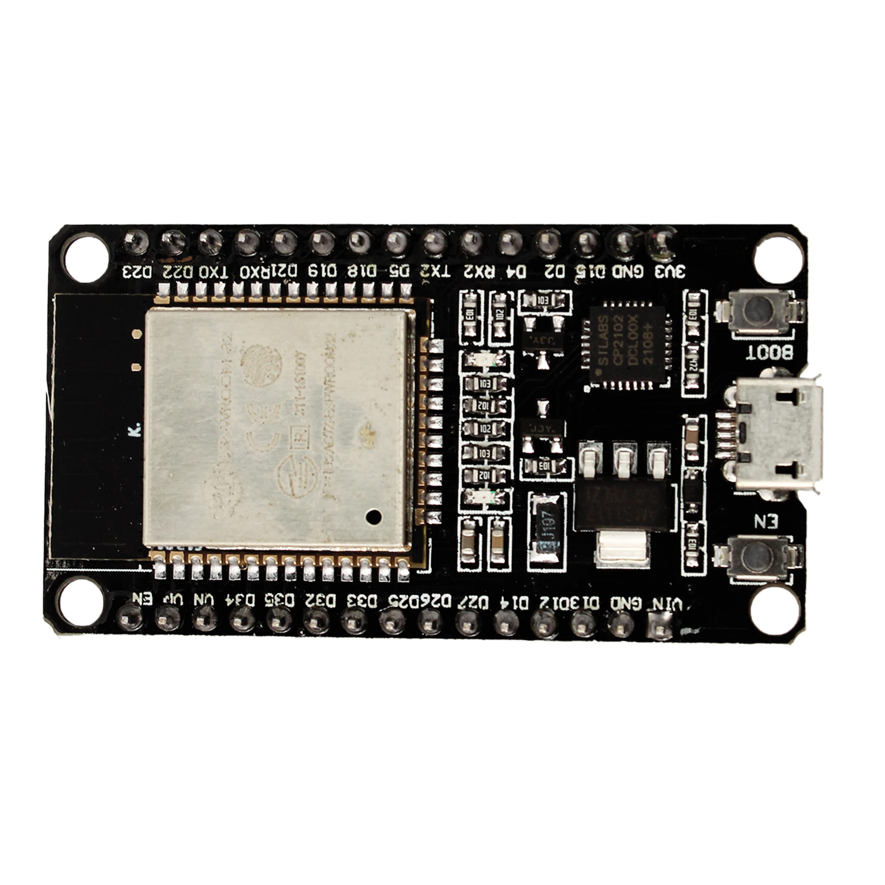
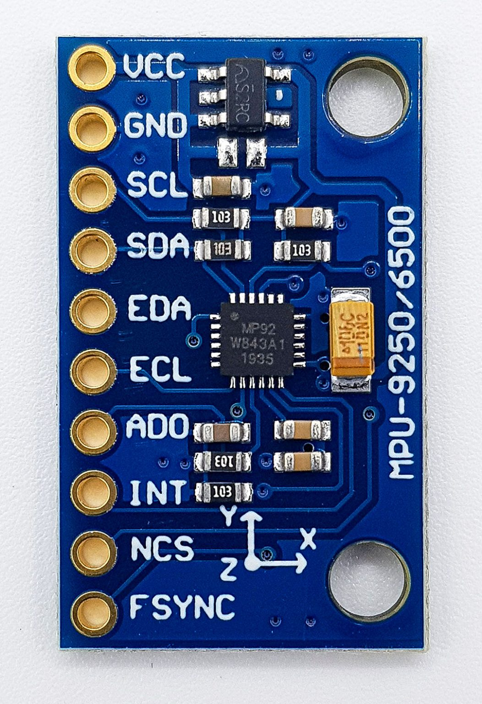
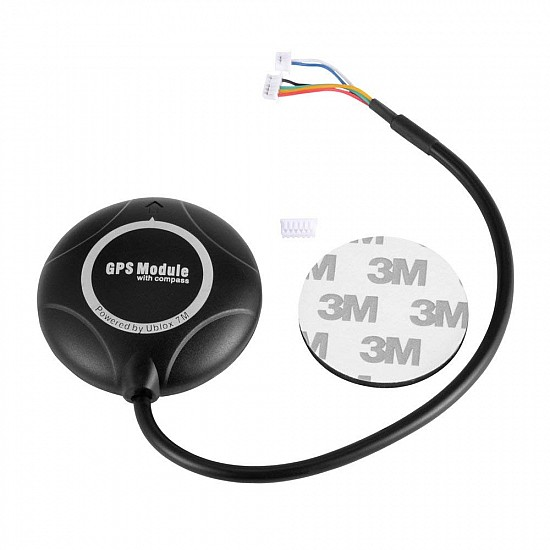
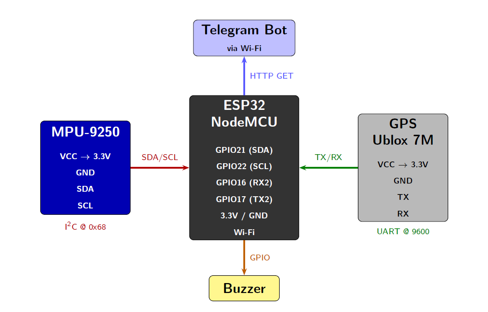
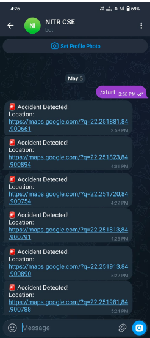

# 🚗 IoT-Based Accident Detection and Emergency Alert System

> A team-developed IoT-based embedded system that detects vehicle accidents using the MPU-9250 sensor and automatically sends real-time GPS location alerts via Telegram using an ESP32 NodeMCU.


---

# 📖 Overview

Road accidents often result in delayed emergency response because victims may be unconscious or unable to communicate their location. This project presents a low-cost IoT-based accident detection and emergency alert system capable of automatically detecting accidents and notifying emergency contacts with the vehicle's live GPS location.

The system continuously monitors acceleration using the MPU-9250 Inertial Measurement Unit (IMU). When the measured acceleration exceeds a predefined threshold, the ESP32 retrieves the current GPS coordinates from the Ublox 7M GPS module and sends an emergency notification through the Telegram Bot API, including a clickable Google Maps location.

---

# ✨ Features

- 🚗 Automatic accident detection using acceleration threshold
- 📍 Real-time GPS location tracking
- 📲 Telegram-based emergency notification
- 🗺️ Google Maps location sharing
- 🌐 Wi-Fi enabled IoT communication
- 🔊 Local buzzer alert
- ⚡ ESP32-based embedded implementation

---

# 🛠 Hardware Components

| Component | Description |
|------------|-------------|
| ESP32 NodeMCU | Main Controller |
| MPU-9250 | 9-Axis Motion Sensor |
| Ublox 7M GPS Module | GPS Receiver |
| Buzzer | Emergency Alert |
| Wi-Fi | Internet Connectivity |

<p align="center">
  
  
  
</p>

---

# 💻 Software Stack

- Arduino IDE
- Arduino C++
- TinyGPS++
- WiFi Library
- HTTPClient Library
- Wire Library
- Telegram Bot API

---

# 🏗️ System Architecture

<p align="center">
  
</p>

---

# ⚙️ Working Principle

1. ESP32 continuously reads acceleration data from the MPU-9250 sensor.
2. The resultant acceleration (G-force) is calculated.
3. If the acceleration exceeds the predefined threshold, an accident is detected.
4. The current GPS coordinates are obtained from the Ublox 7M GPS module.
5. ESP32 connects to the internet via Wi-Fi.
6. An emergency notification is sent using the Telegram Bot API.
7. The emergency contact receives:
   - 🚨 Accident alert
   - 📍 GPS coordinates
   - 🗺️ Google Maps location link
8. A buzzer is activated to alert nearby people.

---

# 📱 Telegram Alert

<p align="center">
  
</p>

The notification contains:

- Accident alert message
- Latitude & Longitude
- Google Maps location link
- Real-time GPS location

---

# 📂 Repository Structure

```text
IoT-Based-Accident-Detection-and-Emergency-Alert-System
│
├── circuit/
│   ├── circuit_diagram.png
│   └── README.md
│
├── docs/
│   ├── Presentation.pdf
│   └── README.md
│
├── firmware/
│   ├── accident_detection.ino
│   └── README.md
│
├── images/
│   ├── esp32.jpg
│   ├── gps_module_ublox7m.jpg
│   ├── mpu9250.jpg
│   ├── telegram_alert.png
│   └── README.md
│
└── README.md
```

---

# 📊 Results

- ✅ Automatic accident detection using MPU-9250 sensor data.
- ✅ Real-time GPS coordinate acquisition.
- ✅ Instant Telegram notification with Google Maps link.
- ✅ Functional ESP32-based embedded system prototype.

---

# 👨‍💻 Team & Contributions

This project was developed as a two-member academic team project.

## Akshay Singh

- Developed the complete ESP32 firmware.
- Implemented the accident detection algorithm using MPU-9250 sensor data.
- Integrated the Ublox 7M GPS module for location tracking.
- Developed Telegram Bot API integration for automated emergency alerts.
- Implemented Wi-Fi communication and HTTP requests.
- Performed software testing and debugging.
- Prepared the patent disclosure documentation.

## Sagar Kumar

- Integrated the hardware components.
- Assembled the hardware prototype.
- Performed circuit wiring and hardware setup.

---

# 🚀 Future Improvements

- GSM/LTE backup communication
- Mobile application integration
- Cloud dashboard for vehicle monitoring
- Machine Learning-based accident detection
- Battery backup system
- SOS button support
- Vehicle health monitoring

---

# 📄 Documentation

The repository includes:

- Project presentation
- ESP32 firmware
- Circuit diagram
- Hardware images

---

# 🎓 Academic Information

**Project:** IoT-Based Accident Detection and Emergency Alert System

**Institution:** National Institute of Technology Rourkela

**Department:** Computer Science and Engineering

**Project Supervisor:** Dr. Dev Narayan Yadav

**Project Type:** Team Project

---

# 📜 License

This repository is shared for educational and research purposes.
